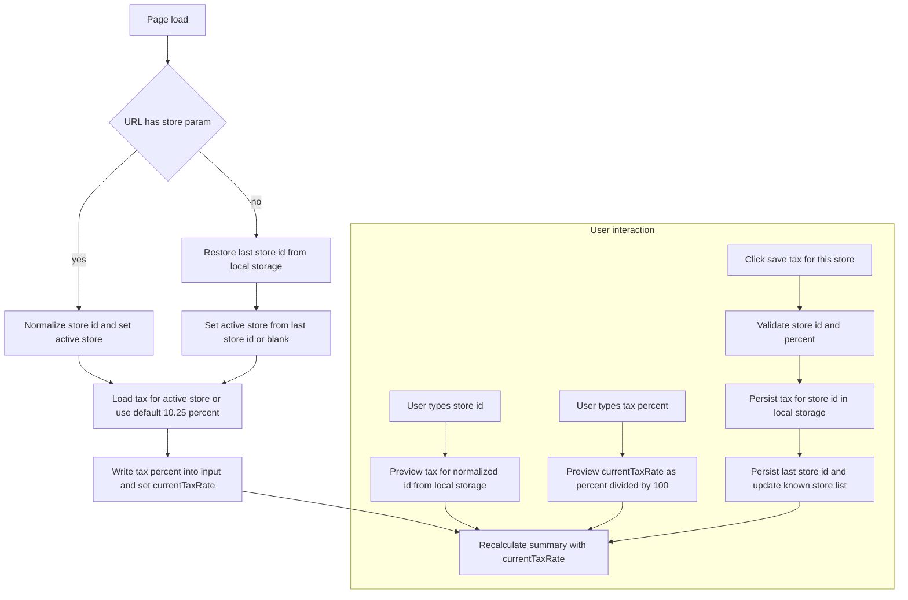

# Screen Repair Form
This is a **web-based form** for generating detailed repair orders for window and door screens. It is designed for in-store employee use to quickly calculate costs, generate totals, and print/share a formatted order summary for customers.

___

## 🛠️ Features
### Customer & Store Input
* Auto-filled **date** field
* Customer **name** & **phone number** (phone auto-formats as (XXX) XXX-XXX)
* **Store ID** field with auto-complete suggestions:
    * Normalized to uppercase with hyphens (IL-EDGEBROOK)
    * SUggestions are remembered per browser using `localStorage`
### Tax Management
* **Custom tax rate per store** (imput as percentage)
* Save button stores the tax rate tues to the Store ID in the browser
* Automatically restores the **last used store** and its tax rate on page load
* Also supports URL parameter to preselect a store:
    * `<URL>?store=IL-EDGEBROOK`
### Screen Entry System
* Add multiple screen with:
    * Width & height (in inches)
    * Quantity
    * Material (e.g. Silver Fiber, Aluminum, Pet Screen, etc.)
    * Optional **corners** ($7 each)
* Prices Automatically calculated
    * Uses nearest preset size for material pricing
    * Glass/Plexiglass costs scale with dimension
* Dynamic totals update live
### Summary Pannel
* Displays:
    * Total Screens
    * Screen Total
    * Labor Charges
    * Tax (store-specific)
    * Grand Total
### Printable Output
* CLicking "**Generate Form**" opens a new tab with a **formatted repair order**, including:
    * Customer Details
    * Store ID and tax rate applied
    * Itemized screen details
    * Totals and disclaimer
* Ready to print or save as a pdf

---

## 🚀 How to Use
1. Open the Form (Click the link below)
    * [Screen Repair Form ↗](https://strong-gumdrop-24c99e.netlify.app) 
    * Works in any modern browser
2. Enter Customer Info
    * Date auto-fills
    * Fill in name and phone
3. Enter Store ID & Tax
    * Fill in a Store ID (e.g. IL-EDGEBROOK)
    * Enter tax-rate (e.g. 10.25)
    * Click "**Save tax for this store**"
    * On next use, the form will remember the Store ID and the tax rate associated with it
4. Add Screens
    * Input size, quantity, and material
    * Optional: add corners
    * Use the "**Add another screen**" button for a screen of different material, size, etc.
    * Remove with the **red x** button
5. Check Totals
    * Live summaryupdates with costs and tax
6. Generate Form
    * Click **Genertae Form**
    * A new tab opens with the formatted repair order
    * Print or save the PDF for records

## ⚠️ Notes
* **Data Storage**: Store IDs and tax rates are saved locally **in the browser's localStorage**, not a server
* **Compatibility**: Fully client-side; no internet required once loaded.

## A Little Background on How browser localStorage is used
**\*Not necessary for implementation in your store! Just a little background on how the program uses YOUR COMPUTER to work!\***  
### Developer Flowchart

